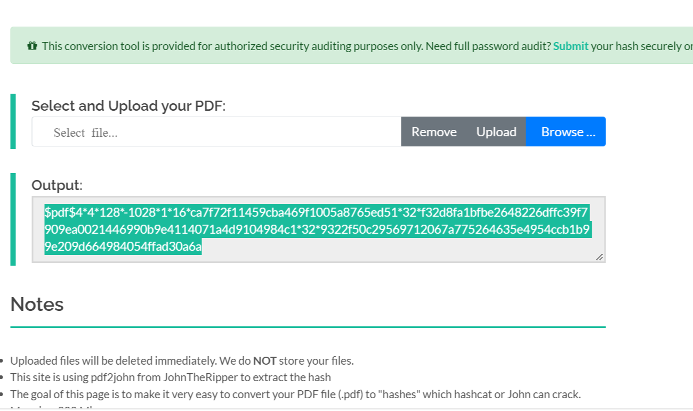

# richirabor-NetworkWalks-B083-Wk3-PM1-Cybersecurity-Lab-SETUP
Password Cracking with JTR and using NetworkWalks Tools 

## 📌 Project Overview

This project focuses on cracking passwords of encrypted files or zipped documents
using different tools such as John the Ripper, which is a graphical version of Johnny 
for recovering strongly protected PDF files and the CLI tool provided by NetworkWalks 
by  using the Hash Calculator to extract the hash from a locked PDF file and use 
the Password Cracker to find the real password from that hash.

## 🎯 Objectives

The main objectives of this project are to:

- Use various Cracking Tools such as JTR and the NetworkWalks Hash Calculator.
- Extract the Hash from the encrypted PDF.
- Decrypt the PDF with the Hash value.
- Use the Hash calculator to unlock the PDF and extract the password.

## Evidence and Results 

## Evidence 1- Hash Extractor Using JTR

  

---
