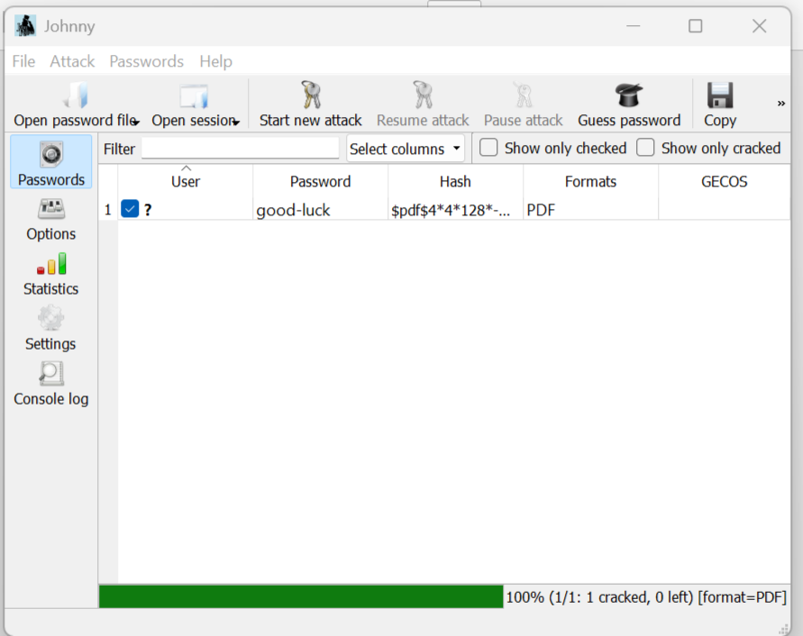
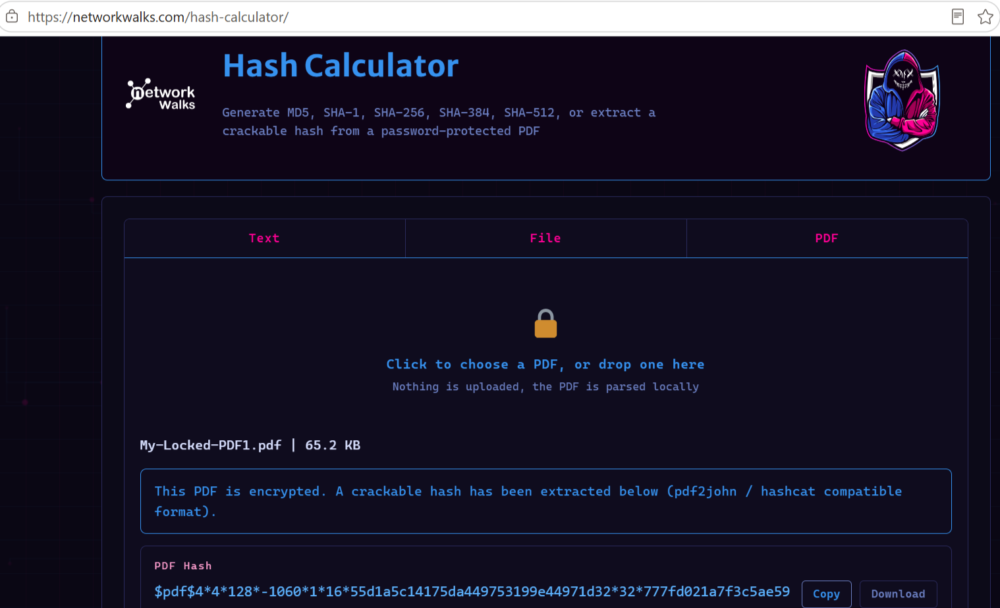
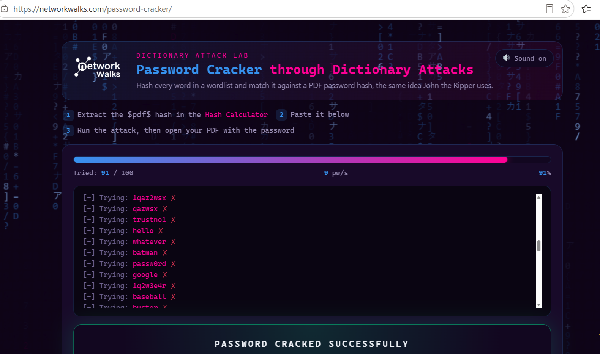
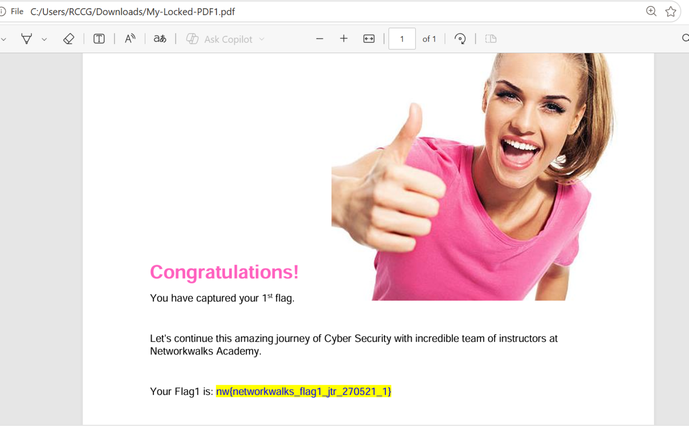

# richirabor-NetworkWalks-B083-Wk3-PM1-Cybersecurity-Lab-SETUP
Password Cracking with JTR and using NetworkWalks Tools 

## 📌 Project Overview

This project focuses on cracking passwords of encrypted files or zipped documents
using different tools such as John the Ripper, which is a graphical version of Johnny 
for recovering strongly protected PDF files and the CLI tool provided by NetworkWalks 
by  using the Hash Calculator to extract the hash from a locked PDF file and use 
the Password Cracker to find the real password from that hash.

## 🎯 Objectives

The main objectives of this project are to:

- Use various Cracking Tools such as JTR and the NetworkWalks Hash Calculator.
- Extract the Hash from the encrypted PDF.
- Decrypt the PDF with the Hash value.
- Use the Hash calculator to unlock the PDF and extract the password.

# Evidence and Results 
---
# Password Cracking Using JTR
## Evidence 1- Hash Extractor Using JTR

  

---

## Evidence 2- Decrypted Password Using JTR

  

---

## Result 1- Decrypted PDF

  

---
# Password Cracking Using NetworkWalks Tools
## Evidence 1- Hash Calculator

  

---

## Evidence 2- Password Cracked

  

---

## Result 2- Decrypted PDF

  

---

## 🔗 Tools & Resources

---

## John the Ripper: 
John GUI - https://openwall.info/wiki/john/johnny

PDF Hash Extraxtor - https://www.onlinehashcrack.com/tools-pdf-hash-extractor.php

## NetworkWalks Tools: 
Hash Calculator - https://networkwalks.com/hash-calculator/

Password Cracker - https://networkwalks.com/password-cracker/
                    
---

## 👤 Author

---

Irabor Richard Ehis

Cybersecurity Internship B083

LinkedIn: https://www.linkedin.com/in/richard-ehis-irabor-46b8899b/

---

## 📌 Project Information

Program Name: Cybersecurity at Networkwalks | Week: 03 | Project: Password Cracking Using JTR and Free Tool | Repository: GitHub
